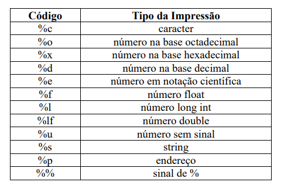

# Linguagem C

%i: inteiro decimal com sinal;

%X: hexadecimal com maiúsculas;

%le: mostra o double em notação científica.

%hd, %hi, %ho, %hu, %hx: tipo short decimal, decimal com sinal, octal, sem sinal e hexadecimal respectivamente.

