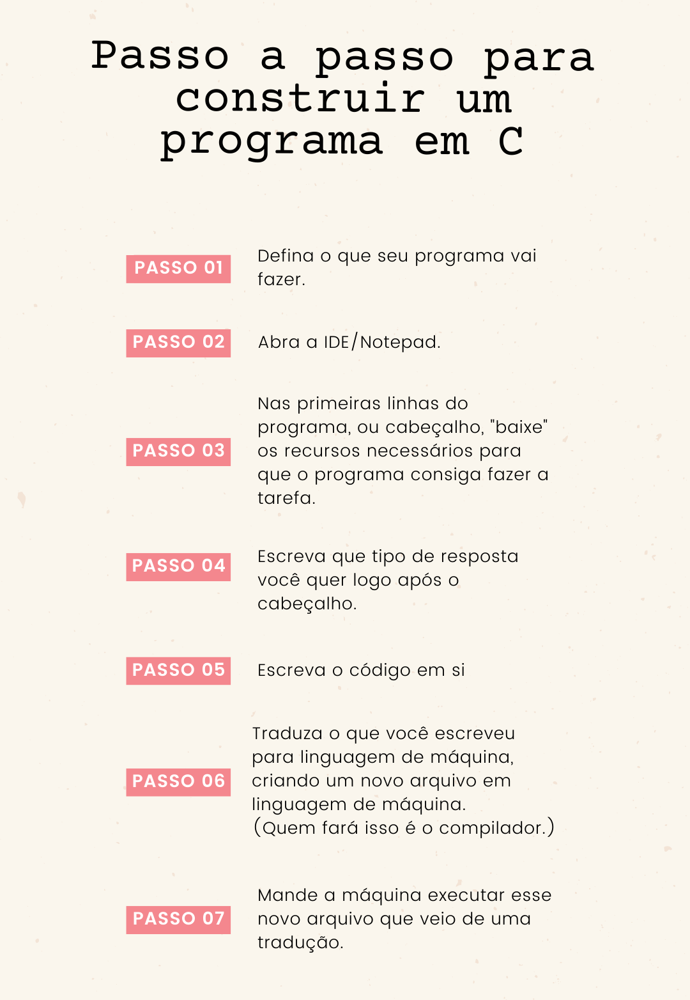
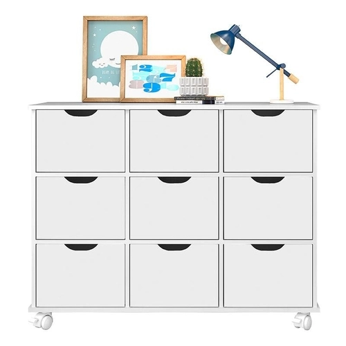

# Linguagem C

## O que temos no repositório

[TOC]

## Como começar a programar em C?

Você pode usar qualquer IDE, que é um programa específico para escrever códigos. Pode ser o VSCode, Sublime ou até mesmo o Notepad! 

Observação: também é possível usar o site OnlineGDB. 

Também será necessário um compilador. Compilador é um programa que vai traduzir o que você escreveu para a linguagem de máquina. Você pode baixá-lo procurando no google "compilador gcc".

### Caminho normal para construir um programa

Sim, parece muita coisa. Mas vai dar certo, confia!

### Escrevendo o primeiro programa

Vamos lá!

#### Passo 01: Defina o que o programa vai fazer.

O programa vai mostrar na tela (ou seja, teremos uma saída de informação para o usuário) a frase "Hello, C world!".

#### Passo 02: Abra a IDE/Notepad.

Vamos começar a primeira linha.

#### Passo 03: Baixe os recursos necessários em cabeçalho.

O programa vai mostrar uma mensagem. Isso é o mesmo que dizer "o programa terá uma saída". E, para que o programa tenha uma saída, precisamos pedir emprestada uma biblioteca ao C. Biblioteca na programação é quase o mesmo que fora da programação. É um "lugar" cheio de instruções e conhecimento. **Vamos usar a biblioteca stdio.h para que o programa pegue as instruções de como exibir uma mensagem.**

*1*		#include <stdio.h> 

#### Passo 04: Escreva que tipo de resposta você quer receber.

A resposta não é necessariamente a saída, ok? São duas coisas diferentes. A resposta é "deu certo" ou "deu errado", e isso é simbolizado por "0" ou "1", respectivamente. **Ou seja, o tipo de resposta (retorno) será um número, falando se deu certo ou se deu errado.**

E, para receber essa resposta, vamos envolver todo o código num **bloco** e, do lado de fora dele, informar que queremos um retorno do tipo int, que é a mesma coisa que "retorno do tipo inteiro", ou "número inteiro". Este "main" quer dizer "principal". Vai ser o principal a ser executado. Sacou?

*2*		int main () {

*3*

*4*		}

#### Passo 05: Escreva o código em si.

Tudo preparado, hora de escrever o que será feito dentro do bloco cercado pelas chaves:

*3*		printf("Hello, C world!");

No final, o programa ficou assim:

*1*		#include <stdio.h> 

*2*		int main () {

*3*			printf("Hello, C world!");

*4*		}

#### Passo 06: Traduza seu código para a linguagem da máquina

a) Salve seu arquivo (ctrl+S) com o nome "helloworld.c" e estaremos prontos.

​			Lembre-se que quem vai fazer esta tradução não é você, e sim o gcc. 

b) Dentro da mesma pasta em que está seu arquivo, clique na barra de endereço (Onde tem "C:\Minha Pasta Tal\Minha Pasta Etc") e digite cmd por cima mesmo. 

c) Na hora vai abrir um prompt de comando, aquela tela preta.

d) Digite na tela: gcc helloworld.c -o helloworld.exe e pressione enter.

e) Volte na sua pasta e veja se um novo arquivo foi criado. Pronto, a compilação aconteceu!

#### Passo 07: Mande a máquina executar seu programa!

No mesmo prompt, digite .\helloworld.exe. Pronto, seu programa está rodando! :D

## Trabalhando com números

### Guardando números em lugares determinados

Trabalhamos nos programas com números, frases, letras, etc. Por exemplo: queremos um programa que some dois números e escreva no console "Olá, {nome da pessoa}! A soma dos dois números é X."

Neste caso, precisamos guardar 4 informações: 

1 - O nome da pessoa;

2 - O primeiro número;

3 - O segundo número;

4 - A soma dos dois números.

Para guardar essas informações e manipular no programa, usamos as **variáveis**.

#### Variáveis

Imagine um móvel organizador com 9 gavetas, como esse:

A memória do computador é como este organizador: tem várias "gavetas" para guardar informações. 

Usando o último exemplo, o da soma dos números, imagine que colamos um adesivo escrito "nome" na primeira gaveta (1A), outro escrito "primeiroNumero" na quinta gaveta (2B), outro escrito "segundoNumero" na sexta gaveta (2C) e o último adesivo escrito "somaDosNumeros" na última gaveta (3C).

Temos 4 adesivos na frente de 4 gavetas. Cada uma das gavetas é uma variável: um espaço para guardar um valor. Assim como guardamos um roupa ou várias numa gaveta, guardamos um valor ou vários valores  numa variável. 

O adesivo na frente das gavetas é o nome da variável.

As localizações da gaveta (1A, 2C, 2B e 3C) são os **ponteiros** de cada variável: **o endereço delas dentro da memória**.

##### Como guardar valores dentro da variável

##### Como ver o que tem dentro da variável

##### Como ver onde esta variável está: Ponteiros

Esse assunto é bem importante, porque ponteiro é o lugar na memória onde está alocada sua variável. Lembra do exemplo do móvel da sala? Ponteiro é o quadradinho que a variável ocupa. 

Quando manipulamos variáveis, elas mudam de valor, mas o espacinho de memória reservado a elas permanece.

Para ver o endereço de memória de uma variável, este é o código:

------

 

%i: inteiro decimal com sinal;

%X: hexadecimal com maiúsculas;

%le: mostra o double em notação científica.

%hd, %hi, %ho, %hu, %hx: tipo short decimal, decimal com sinal, octal, sem sinal e hexadecimal respectivamente.

